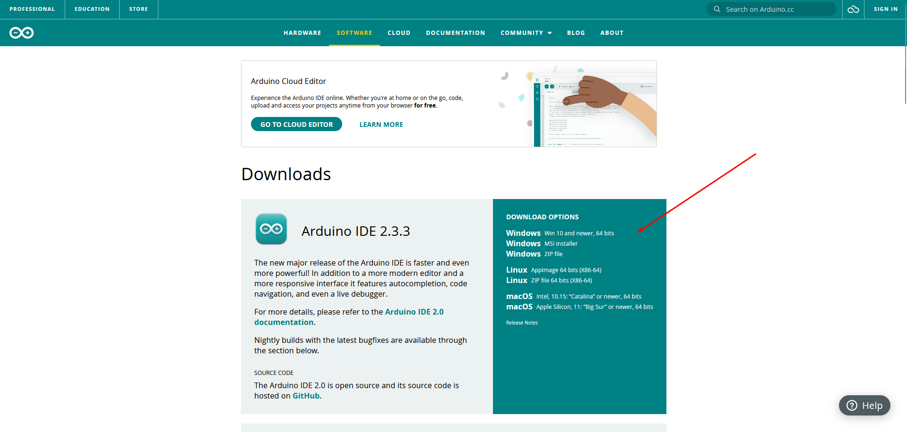

# Дистанционная прошивка ESP32 по Wi-Fi с использованием OTA

В этом руководстве я разберу, как настроить удаленное обновление прошивки ESP32 через Wi-Fi, используя технологию OTA (Over-the-Air). Это позволит обновлять устройства, находящиеся в труднодоступных местах, без необходимости физического подключения.

Я буду использовать библиотеку ArduinoOTA для прошивки ESP32 по сети Wi-Fi, а также настрою подключение к Wi-Fi-сети и управление обновлением с помощью сетевого сервера.

## О технологии OTA


OTA (Over-the-Air) — это метод, который позволяет обновлять прошивку удалённо, что особенно полезно для устройств, доступ к которым может быть ограничен. ESP32 с его встроенным Wi-Fi-модулем позволяет легко настроить OTA.

## Подготовка к работе

### Установка Arduino IDE и библиотек

1. Скачайте и установите Arduino IDE с [официального сайта](https://www.arduino.cc/en/software).


2. Добавьте поддержку ESP32. В **Файл > Настройки** в поле "Дополнительные URL-адреса менеджера плат" добавьте: https://dl.espressif.com/dl/package_esp32_index.json


3. В **Инструменты > Плата > Менеджер плат** найдите и установите ESP32.


4. Установите библиотеку `ArduinoOTA`, которая позволит загружать прошивку по Wi-Fi.
<p align="center">
  
</p>

### Подключение ESP32 к Wi-Fi

Для OTA необходимо подключить ESP32 к сети Wi-Fi. В этом примере я буду использовать параметры сети `"testNetwork"` и пароль `"password123"`.

## Настройка кода для OTA

### Подготовка скетча для OTA и Wi-Fi

Откройте Arduino IDE, создайте новый скетч и добавьте следующий код для настройки Wi-Fi и OTA:

```cpp
#include <WiFi.h>
#include <ESPmDNS.h>
#include <WiFiUdp.h>
#include <ArduinoOTA.h>

const char* wifi_ssid = "testNetwork";     // Имя сети Wi-Fi
const char* wifi_pass = "password123";     // Пароль сети Wi-Fi

void setup() {
Serial.begin(115200);
Serial.println("Запуск устройства");

// Подключаемся к Wi-Fi
WiFi.mode(WIFI_STA);
WiFi.begin(wifi_ssid, wifi_pass);
while (WiFi.status() != WL_CONNECTED) {
 Serial.print(".");
 delay(500);
}
Serial.println("\nПодключение к Wi-Fi выполнено");

// Настройка OTA
ArduinoOTA.onStart([]() {
 String updateType = (ArduinoOTA.getCommand() == U_FLASH) ? "прошивка" : "файловая система";
 Serial.println("Начинается обновление: " + updateType);
});

ArduinoOTA.onEnd([]() {
 Serial.println("\nОбновление завершено");
});

ArduinoOTA.onProgress([](unsigned int progress, unsigned int total) {
 Serial.printf("Прогресс: %u%%\r", (progress * 100) / total);
});

ArduinoOTA.onError([](ota_error_t error) {
 Serial.printf("Ошибка[%u]: ", error);
 if (error == OTA_AUTH_ERROR) Serial.println("Ошибка аутентификации");
 else if (error == OTA_BEGIN_ERROR) Serial.println("Ошибка начала обновления");
 else if (error == OTA_CONNECT_ERROR) Serial.println("Ошибка подключения");
 else if (error == OTA_RECEIVE_ERROR) Serial.println("Ошибка получения");
 else if (error == OTA_END_ERROR) Serial.println("Ошибка завершения");
});

ArduinoOTA.begin();
Serial.println("Готово к OTA-обновлению");
Serial.print("IP-адрес: ");
Serial.println(WiFi.localIP());
}

void loop() {
ArduinoOTA.handle();
}
```
## Объяснение кода

- **Подключение к Wi-Fi**: Используется `WiFi.begin()` для подключения ESP32 к сети Wi-Fi с заданными параметрами. Статус подключения отображается в **Мониторе порта**.
- **Настройка OTA**: Настроены обработчики для отображения процесса обновления и ошибок, включая информацию о типе обновления (прошивка или файловая система).
- **Запуск OTA**: `ArduinoOTA.begin()` активирует функцию OTA на устройстве, а `ArduinoOTA.handle()` в `loop()` позволяет постоянно проверять наличие новых обновлений.

## Проверка подключения к Wi-Fi

1. Подключите ESP32 к компьютеру через USB и загрузите скетч.
2. Откройте **Монитор порта** в Arduino IDE, чтобы увидеть подключение к Wi-Fi и полученный IP-адрес.

**Пример вывода в Мониторе порта:**
```plaintext
Запуск устройства
... Подключение к Wi-Fi выполнено
Готово к OTA-обновлению
IP-адрес: 192.168.1.XXX
```
## Тестирование OTA-обновления

Чтобы проверить работу OTA, добавим код, который будет мигать светодиодом ESP32.

```cpp
const int ledPin = 2;          // Пин светодиода
unsigned long prevMillis = 0;  // Для таймера мигания
const long blinkInterval = 1000; // Интервал мигания в миллисекундах

void loop() {
  ArduinoOTA.handle();

  // Код для мигания светодиодом
  unsigned long currMillis = millis();
  if (currMillis - prevMillis >= blinkInterval) {
    prevMillis = currMillis;
    digitalWrite(ledPin, !digitalRead(ledPin));
  }
}
```
### Описание кода мигания

- **Переменные для мигания**: Используем переменные `prevMillis` и `blinkInterval` для создания эффекта мигания без использования `delay()`.
- **Код в `loop()`**: Логика переключения светодиода каждые 1000 миллисекунд добавлена к `loop()`.

## Запуск OTA-обновления

1. После первой загрузки через USB подключите ESP32 к сети Wi-Fi.
2. В **Инструменты > Порт** выберите сетевой порт с IP-адресом ESP32.
3. Внесите изменения в код и загрузите его по Wi-Fi, выбрав сетевой порт.

**Процесс OTA-обновления:**|


## Важные советы

- **Резервная копия прошивки**: При обновлении критичных устройств полезно иметь резервную копию исходной прошивки. Это особенно важно, если устройство установлено в труднодоступных местах.
- **Безопасность при обновлении**: Во время обновления лучше отключить любые подключенные устройства, если они выполняют критичные задачи.
- **Использование HTTPS**: По возможности обновляйте устройство через защищенное соединение (HTTPS), особенно если обновление выполняется через интернет. Это обеспечит безопасность данных и защиту от атак на устройство.

## Заключение

Удаленное обновление прошивки ESP32 по Wi-Fi значительно упрощает разработку и отладку IoT-устройств. Теперь ваше устройство готово к обновлению "по воздуху" — подключите его к Wi-Fi и загружайте новые прошивки напрямую через сеть.

## Полезные ссылки

- [Документация ArduinoOTA](https://docs.arduino.cc/arduino-cloud/features/ota-getting-started/)
- [Скачать Arduino IDE](https://www.arduino.cc/en/software)

